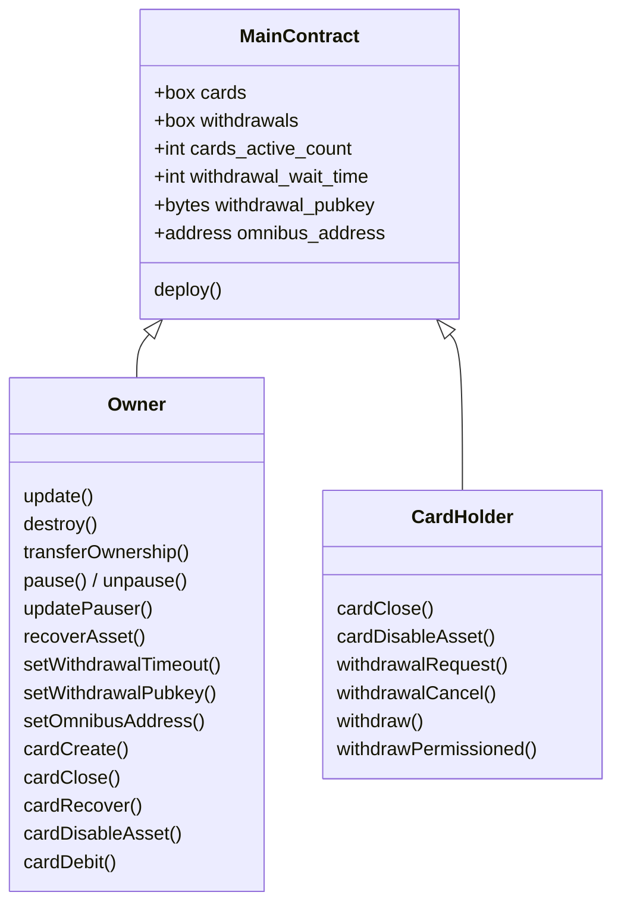
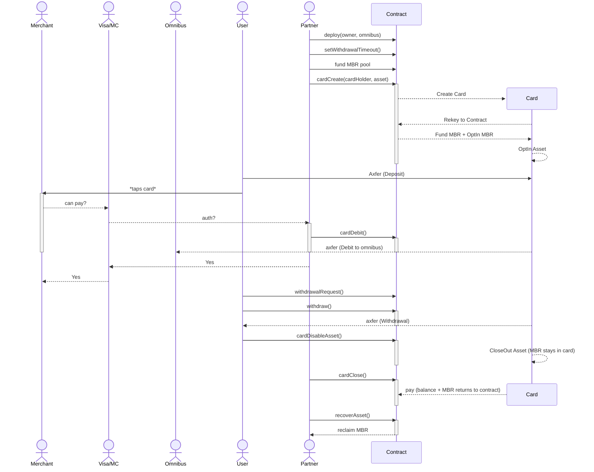

# auto-draw-card

An Algorand smart-contract project (built with [AlgoKit](https://github.com/algorandfoundation/algokit-cli) and Algorand TypeScript) implementing a card-management system with an opt-in automated debit flow. See [Getting started](#getting-started) for setup.

## Concept

This project is built around a **Main** contract that "generates" a new address for each card that's created. Every card is a rekeyed account controlled by the contract.

All minimum balance requirements (MBR) — box storage, account minimum balances and asset opt-in MBR — are **pre-funded by the contract owner**. Callers never attach MBR payments. When a card is closed, the freed MBR returns to the contract and the owner can reclaim it with `recoverAsset`. When a card opts out of an asset (`cardDisableAsset`), the freed opt-in MBR stays within the card account.

Two auxiliary contracts support an automated draw ("AutoDraw") flow on top of the Main contract:

- **Main** ([smart_contracts/main/contract.algo.ts](./smart_contracts/main/contract.algo.ts)) — the card-management application. Documented under [Main contract](#main-contract).
- **Killswitch** ([smart_contracts/killswitch/contract.algo.ts](./smart_contracts/killswitch/contract.algo.ts)) — an application that records which accounts have opted in to AutoDraw delegation, so they can disable it at any time. Documented under [Killswitch contract](#killswitch-contract).
- **AutoDraw** ([smart_contracts/auto_draw/contract.algo.ts](./smart_contracts/auto_draw/contract.algo.ts)) — a delegated `LogicSig` that authorizes an automatic debit from a card, gated by the Killswitch. Documented under [AutoDraw logic signature](#autodraw-logic-signature).

## Roles

- **Owner** — administers the contract: creates/closes/recovers cards, debits cards to the omnibus address, configures the contract (omnibus address, withdrawal timeout, withdrawal public key), and reclaims MBR. Inherited from `Ownable` and transferable via `transferOwnership`.
- **Pauser** — can `pause`/`unpause` the contract, halting debits. Inherited from `Pausable` and updatable via `updatePauser`.
- **Card holder** — the account assigned as a card's `owner`. Can close the card, opt the card out of assets, and initiate/cancel/execute withdrawals.

## Main contract

The card-management application. Its methods are grouped below.

### Administration

#### deploy(address,address)address

Deploy the contract, setting the first address as the owner and the second as the omnibus address. The transaction sender becomes the initial pauser. Returns the contract application address.

#### update()void

Allows the owner to update the contract.

#### destroy()void

Destroy the contract, returning all Algo to the owner. Only possible when there are no active cards.

#### transferOwnership(address)void / owner()address

Transfer or read contract ownership.

#### pause()void / unpause()void / pauser()address / updatePauser(address)void

Pause/unpause the contract and manage the pauser role.

#### recoverAsset(uint64,uint64,address)void

Allows the owner to recover Algo (asset `0`) or any ASA held by the contract — used to reclaim MBR that has returned to the contract. Args: `asset, amount, recipient`.

### Configuration

#### setWithdrawalTimeout(uint64)void

Owner-only. Set the number of seconds a permissionless withdrawal request must wait before it can be executed.

#### setWithdrawalPubkey(byte[32])void

Owner-only. Set the ed25519 public key used to authorize permissioned withdrawals.

#### setOmnibusAddress(address)void / getOmnibusAddress()address

Owner-only setter / read the omnibus address that debited funds are sent to.

### Cards

#### cardCreate(address,uint64)address

Owner-only. Generates a brand new rekeyed account for the given card holder and funds its minimum balance from the contract. If an asset is provided (non-zero), also funds the asset opt-in MBR and opts the card into that asset. Returns the new card address.

#### cardClose(address)void

Owner or card holder. Closes the card account back to the contract and deletes its box, returning all balances and MBR to the contract.

#### cardRecover(address,address)void

Owner-only. Reassigns a card to a new card holder.

#### cardDisableAsset(address,uint64)void

Owner or card holder. Closes the card out of an asset; the freed MBR stays within the card account.

#### getCardData(address)(address,address,uint64,uint64)

Returns a card's `(owner, address, nonce, withdrawalNonce)`.

#### getNextCardNonce(address)uint64

Read a card's debit nonce. (The withdrawal nonce is available via `getCardData`.)

### Debits

#### cardDebit(address,uint64,uint64,uint64,string)void

Owner-only, when not paused. Debits an amount of an asset from a card directly to the omnibus address. Args: `card, asset, amount, nonce, reference`. The reference is attached as the transfer note and the card's debit nonce is incremented.

### Withdrawals

#### withdrawalRequest(address,uint64,uint64)(...)

Card holder. Creates a permissionless withdrawal request for `card, asset, amount` (only one request per card holder at a time). Returns the stored request.

#### withdrawalCancel(address)void

Card holder. Cancels a pending withdrawal request.

#### withdraw(address,uint64)void

Card holder. Executes a pending permissionless withdrawal once the wait time has elapsed. Args: `card, amount`.

#### withdrawPermissioned(address,uint64,uint64,uint64,uint64,byte[64])void

Card holder. Executes a withdrawal before the wait time elapses, authorized by an ed25519 signature from the withdrawal public key. Args: `card, asset, amount, expiresAt, nonce, signature`.

## Killswitch contract

A standalone application ([smart_contracts/killswitch/contract.algo.ts](./smart_contracts/killswitch/contract.algo.ts)) that maintains an opt-in registry of accounts allowed to use the AutoDraw delegation. It lets a card holder enable AutoDraw and, crucially, disable ("kill") it at any time. It inherits `Ownable`, `Pausable` and `Recoverable`, so it also supports `transferOwnership`, `pause`/`unpause`/`updatePauser`, and `recoverAsset`.

Each enabled account is stored in an `accounts` box (MBR owner-funded); enabling is gated by Main card ownership to prevent abuse of that box MBR. The Main application it verifies against is set at deploy time.

### Methods

#### deploy(address,uint64)address

Deploy the contract, setting the first address as the owner and the `uint64` as the Main application ID used to verify card ownership. The transaction sender becomes the initial pauser. Returns the contract application address.

#### enable(address)void

Opt the caller in to AutoDraw delegation. The caller must pass a `card` address they own; ownership is verified via a cross-contract `getCardData` call to the Main contract. Fails if already enabled or if the caller does not own the card. Creates the caller's `accounts` box.

#### kill()void

Opt the caller out of AutoDraw delegation, deleting their `accounts` box. Fails if not currently enabled.

#### authorize(address)void

When not paused, asserts that the given account has AutoDraw enabled (`REFUSED` otherwise). Called as part of the AutoDraw transaction group to confirm delegation is still active; pausing the contract or the account calling `kill()` halts further draws.

## AutoDraw logic signature

A delegated `LogicSig` ([smart_contracts/auto_draw/contract.algo.ts](./smart_contracts/auto_draw/contract.algo.ts)) that authorizes an automatic debit ("draw") of a single asset from a card. It is parameterized with template variables `ASSET`, `GENESIS_HASH`, `KILLSWITCH_APP` and `MAIN_APP`, and only approves a transaction that satisfies all of the following:

- It is a fee-0 asset transfer of `ASSET`, with no rekey and no asset close-out, on the expected network (`GENESIS_HASH`).
- The next transaction (group index +1) is a `Killswitch.authorize` call to `KILLSWITCH_APP` whose account argument matches the transfer sender.
- The transaction after that (group index +2) is a `Main.cardDebit` call to `MAIN_APP` whose `card`, `asset` and `amount` arguments match the transfer's receiver, asset and (as an upper bound) amount.

This enforces that an automated draw can only happen alongside an active Killswitch authorization and a matching Main debit, and that the drawn amount never exceeds the debited amount.

## Contract diagram



## Lifecycle



# Getting started

### Prerequisites

- [Node.js 22+](https://nodejs.org/en/download)
- [AlgoKit CLI 2.6+](https://github.com/algorandfoundation/algokit-cli?tab=readme-ov-file#install)
- [Docker](https://www.docker.com/) — required to run LocalNet
- [Puya compiler](https://pypi.org/project/puyapy/) (installed via AlgoKit)

### Install, build & test

```bash
pnpm install              # install dependencies
algokit localnet start    # start a local Algorand network (Docker)
pnpm build                # compile the contracts and regenerate the typed clients
pnpm test                 # run the test suite against LocalNet
```

Other scripts: `pnpm lint`, `pnpm check-types`, `pnpm format`, and `pnpm deploy` (deploys via `smart_contracts/index.ts`). See `package.json` for the full list.

### Project layout

- `smart_contracts/main/` — the **Main** card-management contract.
- `smart_contracts/killswitch/` — the **Killswitch** opt-in registry contract.
- `smart_contracts/auto_draw/` — the **AutoDraw** delegated `LogicSig`.
- `smart_contracts/roles/` — reusable `Ownable` / `Pausable` / `Recoverable` mixins.
- `smart_contracts/subscriber/` — an event subscriber for Main contract events.
- `smart_contracts/artifacts/` — compiled TEAL, ARC-56 app specs and generated typed clients. These are committed to the repo; rebuild with `pnpm build` after changing a contract so the [output-stability](https://github.com/algorandfoundation/algokit-cli/blob/main/docs/articles/output_stability.md) check passes.

### Testing

Tests run with [vitest](https://vitest.dev/). The end-to-end suite ([smart_contracts/main/contract.e2e.spec.ts](./smart_contracts/main/contract.e2e.spec.ts)) deploys the contracts to `algokit localnet` and exercises the full card lifecycle (create, debit, withdraw, AutoDraw, recover) on a real network, so LocalNet must be running before `pnpm test`.
